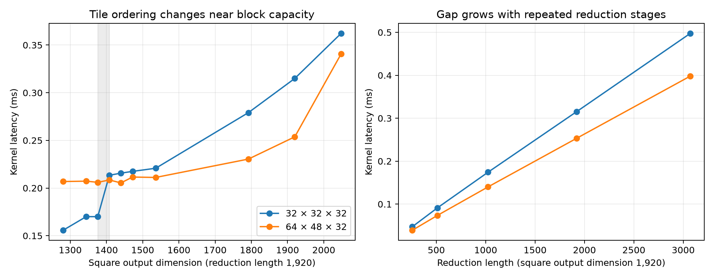

# Why does the larger GEMM tile win?

The 64 × 48 × 32 tile wins over 32 × 32 × 32 on a 1,920-cubed matrix because the two tiles ask the hardware to execute different amounts of staging and control work, and they distribute that work differently across resident blocks. They perform the same matrix arithmetic. Matched profiling and interventions support both explanations. Shared-load bank conflicts are real, but removing almost all of them does not make the larger tile faster in our layout control.

This is a physical diagnosis of the previously observed ranking error, not a new coefficient fit. The revision 003 model remains unchanged. Its chosen tile took about 0.315 ms in the fresh timing sweep; the larger tile took about 0.254 ms. Lower time is better. We cannot yet assign a unique percentage of the gap to each interacting mechanism.

## Setup and measurements

One RTX 5090, device 7, runs the same BF16-input, FP32-accumulation GEMM kernel family. GEMM multiplies an M-by-K matrix by a K-by-N matrix. A block has 128 threads, grouped into four warps of 32 threads. It stages both inputs in shared memory, synchronizes, computes 16-by-16-by-16 matrix fragments, and synchronizes before reusing the buffers. BK = 32, the reduction depth per stage, remains fixed in this diagnosis.

We performed an output-size sweep at K = 1,920, a reduction-length sweep at M = N = 1,920, unused shared-memory reservation controls, and shared-layout padding controls. Each ordinary timing is the median of nine groups of five launches after ten warm-ups, with a separate 512 MiB read sweep before every timed launch. Each condition is repeated twice with reversed tile order. Every output is checked against cuBLAS over the complete output matrix. These deterministic input checks do not establish accuracy on every possible input.

Profiler measurements use Nsight Compute on one matching GEMM launch. They establish instruction counts, service counts, occupancy, and sampled stalls; their durations are not ordinary timings. A newly compiled zero-padding version controls for source and compilation changes in the layout family. Its timings differ slightly from the preserved original executables, so the layout conclusions use matched versions rather than mixing their times.

No L2 model term or cache correction is added. Hardware caches remain active. In particular, global-load instructions are not physical DRAM transactions. All 124 ordinary timing executions across the initial sweep and added controls matched the reference and had no register spills. The [experiment contract](contract.json), [full initial measurements](measurements.json), [additional layout controls](exact_layout_controls.json), and [profiler metrics](profile_metrics.json) preserve the evidence.

## Equal arithmetic, less staging and control work

At M = N = K = 1,920, every output tile fits the matrix exactly. The smaller tile needs 60 × 60 = 3,600 blocks. The larger needs 30 × 40 = 1,200. A larger block computes three times as many output fragments, so total arithmetic remains equal.

The dynamic instruction measurements confirm that equality. An executed warp instruction is one instruction issued for a warp; the integer count below instead counts individual participating thread instructions. Each comparison uses the same counter on both kernels.

| Counter | 32 × 32 × 32 | 64 × 48 × 32 | Reduction with larger tile |
|---|---:|---:|---:|
| Matrix instructions | 3.456 million | 3.456 million | 0% |
| Shared-load instructions | 13.939 million | 13.939 million | 0% |
| Global-load instructions | 13.824 million | 8.064 million | 41.7% |
| Shared-store instructions | 13.882 million | 8.122 million | 41.5% |
| Branch instructions | 8.770 million | 3.787 million | 56.8% |
| Integer thread instructions with true predicates | 4,492.800 million | 3,526.349 million | 21.5% |
| All executed warp instructions | 277.200 million | 199.469 million | 28.0% |

The physical explanation starts with reuse inside each block. A larger output tile uses each staged operand across more output fragments. Fewer blocks therefore reload and stage those inputs. Fewer blocks also execute repeated loop and address-control work. The source has two block synchronizations per stage; the larger grid has one third as many block-stage synchronization instances. This source count is not a measurement of barrier latency.

The SASS disassembly, the actual compiled machine instructions, confirms matrix instructions, shared stores, address calculations, and two reduction-loop block barriers. All six layout variants are saved as `.sass` files. Static instruction counts cannot be substituted for dynamic counts because loops and predicates determine how often instructions execute.

The profiler's global-byte counter does not equal our scalar source-level requested-byte calculation. We preserve it without treating it as DRAM traffic or forcing a physical interpretation. The instruction counts provide the cleaner evidence for reduced staging overhead.

## Resident capacity changes tile ordering

Residency means the maximum number of these blocks that can be simultaneously active on one streaming multiprocessor, the GPU's execution unit. Launch profiling and the CUDA occupancy calculation agree on eleven resident smaller blocks and eight resident larger blocks. With 170 multiprocessors, their predicted whole-device capacities are 1,870 and 1,360 blocks.

At square output size 1,376, the smaller grid has 43 × 43 = 1,849 blocks, just below its capacity. At size 1,408 it has 44 × 44 = 1,936, just above it. In the first timing repetition, its time rises from 0.1700 to 0.2134 ms, a 25.5% increase for a 4.7% increase in output elements. The larger tile stays near 0.206–0.208 ms. The ordering reverses near that transition.

The larger tile has its own capacity transition: its block count is 1,200 at size 1,920 and 1,376 at size 2,048. Its time rises from about 0.254 to 0.340 ms. These observations support finite residency and scheduling effects, rather than an objective based only on total arithmetic and a constant throughput.

Each point is the median of two condition medians. The shaded interval marks the smaller tile's predicted resident-capacity crossing. The left plot changes square output size at fixed reduction length; the right changes reduction length at fixed output size. Lower is better. Counts and times are preserved in [the summary](summary.json).

Capacity is not a promise that blocks start or finish in lockstep. Partial occupancy, scheduling distribution, and instructions issued by different warps determine the actual transition. The square-size sweep also changes the second input's row stride, so a separate fixed-stride boundary comparison holds N and K unchanged while changing only M. At N = 1,344, increasing M from 1,408 to 1,440 changes the smaller grid from 1,848 to 1,890 blocks; time rises from 0.16998 to 0.19742 ms. The larger tile remains at 0.20724 and 0.20644 ms. At N = 1,536, increasing M from 1,216 to 1,248 changes the smaller grid from 1,824 to 1,872 blocks; time rises from 0.16998 to 0.19496 ms. The larger tile stays near 0.205–0.206 ms. Both input row strides are unchanged within each comparison. These [fixed-stride controls](fixed_stride_boundary.json) corroborate the capacity effect without the square-sweep stride confound.

Unused shared-memory reservations further test sensitivity to residency. Reserving 24,576 dynamic bytes reduces both tiles to three resident blocks per multiprocessor; median times rise to 0.679 and 0.523 ms. Reserving 45,056 bytes reduces both to two; times rise to 0.964 and 0.673 ms. The larger tile still wins when the resident-block limits match. Thus the advantage is not explained simply by its original residency number. Reservation also affects memory partitioning and scheduling, so it does not isolate a pure occupancy cost.

The faster unmodified tile has lower achieved occupancy: about 51% versus 76%. Occupancy measures the fraction of maximum resident warps present, not useful arithmetic completed per second. Higher occupancy alone would select the wrong tile here.

## The gap recurs across reduction stages

With output dimensions fixed at 1,920, reduction lengths 256, 512, 1,024, 1,920, and 3,072 correspond to 8, 16, 32, 60, and 96 stages. Fitting an ordinary straight line to these stage counts and the measured condition medians gives:

| Tile | Added whole-kernel time per stage | Fitted intercept |
|---|---:|---:|
| 32 × 32 × 32 | 5.101 microseconds | 8.837 microseconds |
| 64 × 48 × 32 | 4.071 microseconds | 8.185 microseconds |

The largest deviations from the fitted lines are 2.54 and 1.84 microseconds. These are descriptive fits to the diagnosis data, not new MILP coefficients. The added time represents the whole grid's work for an extra stage, not the latency of a single barrier or matrix instruction.

The larger tile has about 20% lower recurring cost, while the fitted intercepts are close. At sixty stages, the slope difference contributes approximately 61.8 microseconds, close to the observed approximately 61-microsecond difference. This supports a repeated execution-cost explanation rather than startup overhead. It does not separate staging, synchronization, and scheduling: each stage encounters all three.

## Bank conflicts change, but do not explain the gap alone

Padding inserts unused BF16 elements at the end of each shared-memory row while preserving matrix dimensions and arithmetic. Eight-element padding changes the smaller tile's input strides from 32 to 40, and the larger tile's strides from 32 and 48 to 40 and 56. Sixteen-element padding produces strides 48 and, for the larger second operand, 64.

NVIDIA documents shared memory as 32 banks, with successive four-byte words mapped to successive banks. Consequently, the bank number for a byte address is its four-byte word index modulo 32. For BF16 rows of 32 elements, row starts advance sixteen banks; for forty elements they advance twenty. This changes which rows return to the same bank. The rule explains why padding changes access patterns, but the exact conflict multiplicity also requires the per-lane accesses and the instruction's transaction decomposition. [NVIDIA CUDA programming guide](https://docs.nvidia.com/cuda/cuda-programming-guide/02-basics/writing-cuda-kernels.html).

The measured load-conflict counters show a large intervention:

| Tile | Unpadded load conflicts | Eight-element padding |
|---|---:|---:|
| 32 × 32 × 32 | 41.796 million | 0.0435 million |
| 64 × 48 × 32 | 28.024 million | 0.0495 million |

Shared-load service wavefronts also fall, from 55.735 to 13.983 million for the smaller tile and 41.963 to 13.989 million for the larger. A service wavefront is a portion of a request serviced by shared memory; fewer means less service work, not automatically less kernel time.

Padding changes allocated shared memory and, for the smaller tile, registers from forty to forty-eight per thread. We therefore compare the padded version against its zero-padding version with the same dynamic allocation, alternating their order twice:

| Tile and padding | Unpadded with matched allocation | Padded with matched allocation | Resident blocks in both |
|---|---:|---:|---:|
| Smaller, eight elements | 0.33588 ms | 0.32359 ms | 10 |
| Smaller, sixteen elements | 0.33526 ms | 0.32460 ms | 9 |
| Larger, eight elements | 0.32953 ms | 0.33341 ms | 7 |
| Larger, sixteen elements | 0.37233 ms | 0.39853 ms | 6 |

Removing nearly all load conflicts improves the smaller tile by approximately 3.7% under the allocation control, but makes the larger tile approximately 1.2% slower. This rejects a simple claim that shared-load conflicts alone cause the original larger-tile advantage. The intervention still changes generated instructions and operand dependencies, so the 3.7% cannot be labeled an isolated bank-conflict cost.

For the larger tile, sixteen-element padding increases load conflicts to 55.752 million and worsens time under the matched allocation. This is consistent with an adverse bank pattern, but remains a combined layout-and-compilation effect. The sampled shared/dependency stall percentage also changes; stall percentages are normalized observations, not additive fractions of wall time.

We reconstructed the source-level shared addresses and preserved the compiled instructions. We have not completed a verified per-lane, per-instruction WMMA address trace. NVIDIA specifies the WMMA fragment distribution as target dependent, so the high-level API alone does not supply that trace. We do not claim an exact bank-conflict formula from row stride alone. [NVIDIA PTX instruction documentation](https://docs.nvidia.com/cuda/archive/11.1.1/parallel-thread-execution/index.html).

## What this means for the formulation

The current model already counts operand work and resident capacity, but its learned aggregate costs do not capture their interactions accurately enough to select this winner. Four productive warps is too broad a class: both tiles have four, while one computes three fragments per warp and amortizes staging and control differently. An integer ceiling for wave count also omits the distribution and overlapping completion of blocks.

The next formulation should represent staging/control instruction demand and its amortization, shared service demand, and the relationship between available blocks and resident capacity. It should preserve the fact that fewer conflicts can lose when residency or scheduling worsens. These are candidate physical terms, not yet validated coefficients or a guarantee of accurate prediction.

The experiments establish a bounded mechanism-level explanation: equal matrix work, less staging and control work, and capacity-sensitive scheduling favor the larger tile on this workload. They do not isolate undocumented issue latencies, attribute every microsecond, or establish behavior for other kernel families. The existing MILP remains unchanged so these diagnostic observations are not presented as a fresh held-out model success.
