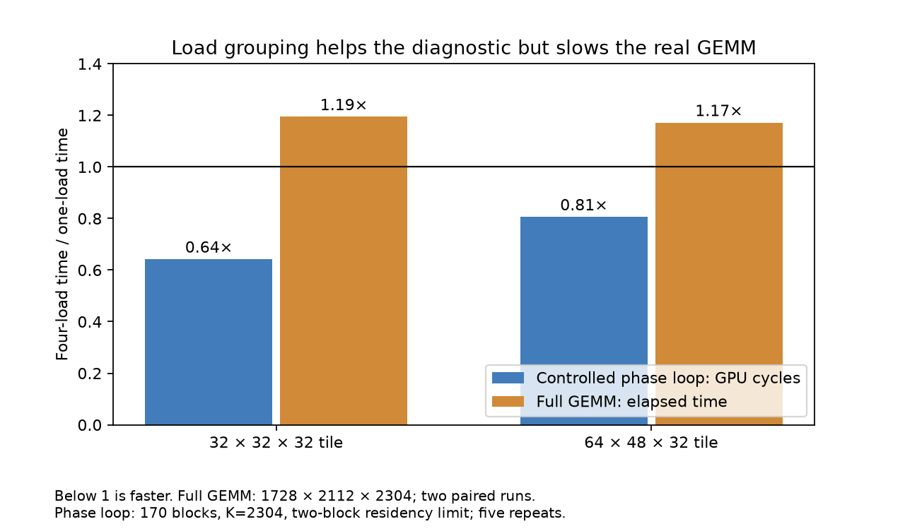

# Memory staging costs depend on the compiled execution schedule

We tested whether moving matrix operands into shared memory has a cost that can simply be added to computation time. The controlled phase loop shows that this assumption can fail. However, a load schedule that improves the diagnostic slows the real GEMM. The strongest new evidence is therefore about the importance of the compiled instruction sequence and its resource requirements, rather than a newly identified memory-latency constant.

The existing MILP model remains unchanged. Explicit L2 modeling is still excluded, and hardware caches remained active throughout.

## A controlled comparison of staging and computation

The diagnostic uses four warps per block, BF16 inputs, FP32 accumulation, and the same matrix primitive and shared layouts as the original tile family. Four versions execute a common loop: a control, operand staging alone, matrix computation alone, and both together. Staging reads global memory and writes shared memory. Computation loads matrix fragments from shared memory and accumulates their products. Every version also sums the shared operands, which keeps the staging observable to the compiler. This checksum is extra work absent from the production GEMM.

We compare five-repeat median cycles per reduction stage. A reduction stage processes 32 elements along the matrix reduction dimension. Lower cycles are better. To predict the combined cost from isolated costs, we add staging and computation and subtract the control once; otherwise we would count the common loop, checksum, and barrier work twice.

For 170 blocks, reduction length 2304, and a shared-memory reservation that limits every diagnostic variant to two resident blocks per SM:

| Output tile | Control | Staging alone | Computation alone | Additive prediction | Measured combined |
|---|---:|---:|---:|---:|---:|
| 32 by 32 | 718 cycles | 4461 cycles | 1247 cycles | 4990 cycles | 5098 cycles |
| 64 by 48 | 830 cycles | 4099 cycles | 2038 cycles | 5307 cycles | 7053 cycles |

For the larger tile, the combined loop takes 32.9% more cycles than this additive prediction. The smaller tile differs by 2.2%. The larger discrepancy also appears with one block, where competition between resident blocks cannot explain it. Register requirements and the compiled sequence still differ between isolated and combined versions, so the comparison establishes a failure of this additive diagnostic approximation, not a unique physical bottleneck.

The full sweep covered both tiles, reduction lengths 768 and 2304, one, 170, or 1020 blocks, and natural or restricted block residency. All 840 measurements passed numerical checks and used no register spills. Compiled instructions retain the expected matrix work and observable shared-memory checksum. The added-barrier variant retains an actual extra barrier in the compiled instruction stream. Its timing changes are small compared with the load-schedule effects; that does not show that the original necessary barriers are free or removable.

## The diagnostic improvement fails to transfer

We changed the staging schedule from one load followed by its store to groups of four loads before their stores. The diagnostic uses explicit scalar global-load instructions. With the matched two-block residency described above, the grouped combined loop takes 35.7% fewer cycles for the smaller tile and 19.4% fewer cycles for the larger tile.

We then implemented the same source-level grouping in the real GEMM, using its ordinary C++ loads, full row-major matrix layout, boundary handling, shared-memory layout, and original necessary barriers. Every output was checked against cuBLAS. Two paired runs reversed the schedule order. Each execution reported nine timing samples, with the original cache sweep before each launch. The table gives the median across those samples from both runs. Lower milliseconds are better.

| Matrix shape: rows, columns, reduction length | Output tile | One-load schedule | Four-load schedule | Increase in elapsed time |
|---|---|---:|---:|---:|
| 960, 1152, 640 | 32 by 32 | 0.04342 ms | 0.04710 ms | 8.5% |
| 960, 1152, 640 | 64 by 48 | 0.07167 ms | 0.08189 ms | 14.3% |
| 1728, 2112, 2304 | 32 by 32 | 0.37110 ms | 0.44339 ms | 19.5% |
| 1728, 2112, 2304 | 64 by 48 | 0.26911 ms | 0.31539 ms | 17.2% |

All 16 full-GEMM executions passed correctness checks without spills. For the smaller tile, grouping raises registers per thread from 40 to 48 and reduces the resident-block limit from 11 to 10. For the larger tile, both schedules use 64 registers and allow eight resident blocks, yet grouping still slows execution. Occupancy loss therefore cannot explain all four slowdowns.

The diagnostic and real kernel differ in checksum work, global addressing and block mapping, load compilation, boundary predicates, and timing conditions. These differences prevent using the diagnostic speedup as a prediction for production. This failed transfer is useful evidence: the hardware model must describe the actual compiled kernel and access pattern, not just a superficially similar microbenchmark.

## Matching residency exposes additional instruction work

We repeated the larger matrix workload with the same 49,152-byte dynamic shared-memory reservation for both schedules. Including the real GEMM's static shared memory, this limits every version to one resident block per SM. This differs from the diagnostic's two-block limit, but matches residency within the full-GEMM comparison. Eight additional paired executions passed full-output correctness checks without spills.

Grouping still increases elapsed time: by 16.3% for the smaller tile and 22.5% for the larger tile. The corresponding profiler runs record identical global-load instruction counts, shared-load and shared-store counts, and global-load request sectors within each tile pair. A request sector is a 32-byte unit counted at the global-load request interface; it is not a DRAM-byte count and does not establish identical service timing.

| Output tile | One-load total warp instructions | Four-load total warp instructions | Increase |
|---|---:|---:|---:|
| 32 by 32 | 277,464,528 | 342,158,256 | 23.3% |
| 64 by 48 | 184,562,928 | 276,423,840 | 49.8% |

Thus, grouping preserves measured memory work while adding substantial other instruction work. The grouped larger tile has the same registers and residency as its baseline, so extra instruction execution and changed dependencies are stronger leads than capacity alone. We have not separately isolated which address calculations, predicates, or scheduling dependencies account for that extra cost.

The profiler's long-scoreboard stall percentages also decrease under grouping: from 54.50% to 44.87% for the smaller tile and from 58.83% to 44.48% for the larger tile. A scoreboard tracks whether instruction operands are ready; these stalls are associated with waiting on the global/local/texture memory path. Their percentages describe warp scheduling observations, not fractions of total runtime. A lower stall percentage alongside a slower kernel is a concrete reason not to optimize this counter in isolation. Profiler timings are not substituted for the ordinary paired timing measurements.

## What this changes about the hardware model

The experiment supports three decisions. First, reject grouped loads as an optimization for these four GEMM cases. Second, represent the compiled non-matrix instruction work and its dependencies alongside matrix and memory service demand. Third, condition those costs on the actual resource-limited execution state; a single isolated phase constant does not transfer reliably here.

It does not prove that instruction overhead causes the residual error of the unchanged MILP model. These schedule variants are outside that model's current software choices. Nor does it uniquely identify an operand collector, register port, or memory queue as the bottleneck. Those remain hypotheses requiring more specific controls.

The next narrow experiment should preserve the original production instruction mix and add measurements around its staging and computation boundaries, with a control for the timestamp overhead. That would connect phase costs to the original kernel rather than changing its work to keep isolated phases observable. Such instrumentation can itself perturb scheduling, so its compiled instructions and uninstrumented runtime must be compared before adopting the measurements. A model revision should then predict an untouched workload before its coefficients are accepted.

Clock, power, and temperature snapshots were collected for the phase sweep; clocks were not locked, and snapshots do not establish constant conditions during every short kernel. Full-GEMM timing uses repeated warm execution and paired order, but lacks a continuous clock trace. These limitations remain relevant to absolute-time accuracy. No claim is made that the underlying hardware is fully characterized.

The [experiment plan](experiment.md), [summary](summary.json), [phase measurements](measurements.json), [full-GEMM confirmation](confirmation.json), and [matched-residency confirmation](reserved_confirmation.json) preserve the comparisons and raw evidence. Compiled instruction listings and eight profiler reports are alongside them. The current conclusion is bounded: execution schedule and additional compiled instruction work matter, while the root cause of the existing model's remaining error is still unresolved.
