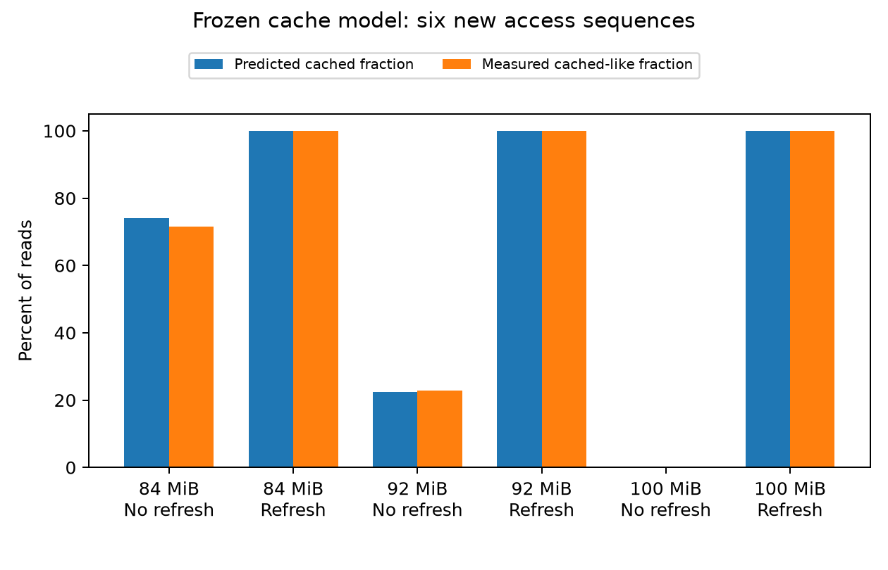

# An explicit L2 state model: what the RTX 5090 measurements support

## Question and current answer

Can we predict cache behavior by following the kernel's accesses and the data that remains cached, instead of assigning a fitted hit rate to each matrix shape?

We now have an executable model that tracks allocation tags, valid 32-byte sectors, and replacement order. Its recency-based version predicts six new controlled access sequences within **2.6 percentage points of the measured cached-like fraction** and **2.5% of the measured traversal time**. On a separate real GEMM with inputs larger than L2, an interleaved-access trace predicts the measured L2 request, hit, and miss sector counts exactly for both original kernels.

These results validate useful mechanisms, but they do not complete the physically grounded performance model. Near full occupancy, address placement changes the observed memory-path delay in a way the fully associative model does not capture. Moreover, the previous whole-GEMM runtime model still has large extrapolation errors on the new long-reduction workload. The cache-content model and the execution-timing model must be evaluated separately.

## Concrete setup and the modeled state

The GPU is the RTX 5090 on server GPU 7. Its reported L2 capacity is 96 MiB. A MiB is 1,048,576 bytes. L2 is a cache shared by the streaming multiprocessors, or SMs; an SM executes groups of GPU threads.

The controlled experiment warms a 16 MiB anchor region, reads a separate pressure region, and then follows pointers through the anchor. Each next address requires the previous load's result. This makes the measured reads sequentially dependent. A 512 MiB sweep precedes each warm-up, and the final pointer is checked against the expected position.

The model in [cache_model.hpp](cache_model.hpp) stores three pieces of state. An allocation tag identifies the address range occupying a cache slot. A validity mask records which 32-byte sectors within that range contain fetched data. Replacement order records which resident tags were used recently. A larger tag does not mean that every sector within it is valid.

On a read, the model tests the tag and the requested sector. A valid sector is a hit and updates recency. Otherwise, the model fetches that sector and marks it valid, allocating a tag and evicting an older tag if necessary. The current implementation completes the modeled fill immediately. Asynchronous fills, pending requests, and miss merging are not yet simulated.

We retain two allocation-size candidates, 32 and 128 bytes, with separate sector validity. Both fit the current confirmation evidence, so the actual tag size is not identified. The model also treats placement as fully associative: any allocation may occupy any slot. That is a hypothesis, not a claim about the GPU's set mapping. The 32-byte counter unit is directly observed; the exact DRAM transfer granularity is not inferred from it.

## Measurements must distinguish cache state from timing disturbance

The first hardware profiles used aggregate L2 read counters. They included requests that could not be assigned to the pointer traversal. Source-specific counters fixed the attribution: the probe issued exactly 32,768 global-read sectors, and the L2 source-specific request total matched that number.

However, profiling disturbed borderline conditions. At 80 MiB of pressure, the profiled traversal was about 70% slower than neighboring ordinary traversals in the same process. At 88 MiB it was about 24% slower. Those profiled mixtures were excluded from cache-state calibration. Disabling profiler cache flushing and using application replay are necessary controls, but they are not sufficient to establish undisturbed execution.

The alternative measurement records a latency histogram in 260 bytes of shared memory. Each timed interval includes a global load followed by a shared store that consumes the loaded value. Compiled instructions confirm that the store waits for the load before the second clock read. The histogram remains on chip until traversal ends, and the compiler reports zero spills. This measures readiness for the dependent store to issue, not completion of every memory operation in a GEMM stage.

The clearly cached and clearly displaced controls have well-separated distributions. A threshold of 576 cycles was fixed from those endpoints before the fresh tests. Reads below it are called **cached-like**; reads above it are called **displaced-like**. These are latency classes, not exact hardware hit labels. Address translation and other delays can also affect latency. Direct L2 counters separately confirm all-hit, all-miss, and refreshed all-hit control states, although profiling changes their cycle observations. Consequently, profiled cycle values are not adopted as hardware latency constants.

## Recency changes the result even when the footprint is unchanged

The distinguishing sequence warms the anchor, reads 64 MiB of pressure, optionally rereads the anchor, then reads another 24 MiB of pressure. Both versions touch the same distinct data. An empty warm-up launch replaces the reread in the control version, so the number of launches is matched.

First-in-first-out replacement preserves insertion age when data is reread. It therefore predicts about half of the anchor reads remain cached in either version. Least-recently-used replacement updates age on rereads and predicts that refreshing the anchor protects it from the final pressure.

Across three paired rounds, the control had about **47% cached-like reads** and the refreshed version had **100%**. The refreshed version also had 32,768 L2 hits and zero L2 misses in its separate direct-counter check. This rejects the simple FIFO candidate for this sequence and supports recency-sensitive protection. It does not prove that the hardware implements exact least-recently-used replacement.

## Independent confirmation of the controlled model

Capacity, candidate policies, endpoint costs, classifier, and predictions were saved before measuring the new pressure sizes. The instrumented traversal endpoint costs were about 417 cycles for the cached control and 999 cycles for the displaced control, including histogram-loop work. The model predicts average traversal cost by weighting those endpoints with its predicted hit fraction. These costs belong to this 32-bit global-to-shared measurement, not to the BF16 GEMM kernel.

| Pressure | Anchor refreshed? | Predicted cached fraction, two candidates | Measured cached-like fraction |
|---|---|---:|---:|
| 84 MiB | No | 73.8–74.1% | 71.5% |
| 84 MiB | Yes | 100% | 100% |
| 92 MiB | No | 21.2–22.5% | 22.9% |
| 92 MiB | Yes | 100% | 100% |
| 100 MiB | No | 0% | 0% |
| 100 MiB | Yes | 100% | 100% |

Before measurement, we required every fraction error to be at most five percentage points and every relative timing error to be at most 10%. Relative timing error is the absolute prediction difference divided by measured time. Both candidates meet these conditions on all six sequences: the largest fraction error is 2.6 percentage points and the largest timing error is 2.5%. Each sequence has seven ordinary measurements, all with correct pointer results and histogram totals. The saved model and prediction hashes remain unchanged.

This is confirmation against latency classes and traversal time. It is not a claim that mixed-condition hardware hit rates were measured to that accuracy.

## Real GEMM: reuse lifetime matters more than total input size

The new workload multiplies a 64-by-327,680 BF16 matrix by a 327,680-by-96 BF16 matrix, producing FP32 output. Its distinct inputs occupy **100 MiB**, exceeding the 96 MiB cache. The original 32-by-32 output tile launches six blocks; the original 64-by-48 tile launches two.

The [GEMM trace generator](gemm_cache_trace.cpp) reconstructs requested input sectors from tile coordinates and reduction stages. It compares serial block execution with stage-interleaved execution. In the latter, every active block processes a reduction stage before the trace advances to the next stage. This is a scheduling hypothesis, not a reconstruction of exact GPU issue times. Output stores are omitted in this test; the complete output is only 24 KiB.

| Original output tile | Requested reads | Interleaved prediction: hits / misses | Measured L2 hits / misses |
|---|---:|---:|---:|
| 32 × 32 | 7,864,320 sectors | 4,587,520 / 3,276,800 | 4,587,520 / 3,276,800 |
| 64 × 48 | 4,587,520 sectors | 1,310,720 / 3,276,800 | 1,310,720 / 3,276,800 |

A sector is 32 bytes. The miss totals correspond to the 100 MiB of distinct input data. Aggregate DRAM-read counters are slightly higher and vary between passes; they include traffic beyond these source-specific requests. They are not treated as exact per-input transfer counts.

The interleaved trace matches all three source-specific counts for both allocation-size candidates. Some serial predictions disagree, but the totals do not uniquely identify the real execution order. The physical insight is that neighboring blocks can reuse a stage's data while it remains resident. Total inputs may exceed capacity even when the data needing simultaneous reuse occupies a much smaller window. Therefore the earlier rule admitting only inputs-plus-output smaller than L2 was unnecessarily restrictive for this workload.

The profiles measured the first ordinary cold-start timing launch after its explicit sweep. Direct device durations differ from the ordinary medians by about 0.6% and 0.2%, and a repeated profile reproduces the same source-specific counts. The much larger first CUDA-event average in the profiling process includes profiler pauses; it is not the kernel's device execution time. All outputs in the ordinary and profiled executions were numerically correct, and the original kernels remained spill-free.

## The retained boundary failure

At 16 MiB of anchor plus 80 MiB of pressure, the fully associative capacity model predicts all hits. The ordinary traversal nevertheless has about 86% cached-like reads. This is a failure of the combined state-and-latency explanation; the indirect classes alone do not establish how much is L2 eviction versus another delay.

Holding the same allocation, footprint, and read order fixed, moving the pressure region by 1 MiB reduced the cached-like fraction to about 80%. A 4 MiB shift returned it to about 86%. The difference reproduced across three rounds. Thus placement is consequential, but these shifts do not identify an exact cache hash or associativity.

A separate locality control measured the oldest 1 MiB of the anchor, its newest 1 MiB, and a scattered traversal. At the same pressure, their cached-like fractions were about 92%, 100%, and 86%, respectively. This establishes age/locality sensitivity. It does not uniquely separate translation from cache placement. A small-ring screen with at most 2 KiB of requested data found no displaced-like reads across its tested strides and node counts; it supplies no conflict rule to adopt.

The boundary discrepancy remains visible in the model manifest. We do not fit an address-dependent correction without a distinguishing mechanism.

## What this means for the complete performance model

The executable cache model now has explicit state, direct traffic validation, and a replacement-order intervention. The remaining cache question is how address placement and translation produce the full-occupancy delay. The next cache experiment should isolate those effects with direct lookup-counter controls that preserve the tested state.

Accurate cache traffic also does not determine complete GEMM runtime. On the new very-long-reduction workload, the previous fitted runtime model predicts 25.69 ms versus 18.82 ms for the smaller tile, and 37.83 ms versus 33.22 ms for the larger tile. Those are **36.5% and 13.9% errors**, far outside the previously tested reduction range. The earlier 4.6% median result remains bounded evidence on its original confirmation workloads.

After the cache mechanism is resolved, the execution model must account for the dependencies and overlap in the actual compiled load, store, synchronization, and matrix instruction sequence. The histogram endpoint costs must not be substituted directly for those instructions. The first phase has produced a validated cache-model component and precise remaining gaps; the accurate full-domain performance model is still unfinished.
