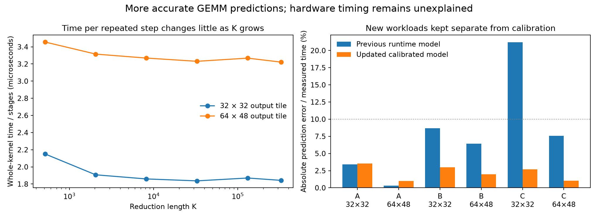

# Better GEMM predictions, but the hardware explanation is still incomplete

Can we explain why our RTX 5090 GEMM model predicted 25.69 milliseconds for a computation that actually took 18.82 milliseconds? We ran the promised controls: different reduction lengths, different numbers of blocks, small tests of the memory and matrix operations, and new GEMM workloads kept separate from calibration.

The revised calibrated model predicts the new full-tile workloads with **2.3% median error and 3.5% maximum error**. This is useful progress in prediction. However, a second approach that tried to build those predictions directly from the small hardware tests failed. The accurate, physically grounded model remains unfinished. The distinction matters: learning the right average time for a kernel is easier than explaining why the hardware takes that time.

## What we measured

A GEMM multiplies two matrices and produces an output matrix. Our kernels divide that output into blocks. The smaller kernel produces a 32 by 32 output tile per block; the larger produces a 64 by 48 tile. Each block uses four warps, where a warp is a group of 32 threads scheduled together. The GPU has 170 streaming multiprocessors, the processing units that run these blocks.

Inside a block, the computation repeats the same sequence. It reads the next input section from global memory, puts those values in shared memory accessible to the block, waits until all threads can use them, performs matrix operations, and waits before overwriting the shared inputs. Each repetition consumes 32 elements of the reduction dimension, called K. A reduction length of 327680 therefore requires 10240 repetitions.

We used the two original compiled kernels without changing their instructions. Each timed launch began after a 512 MiB read sweep intended to displace earlier cached data; the sweep was excluded from timing. Every original-kernel case checked the full output against cuBLAS. Timing for each case consists of nine observations, each averaging five launches. We compare medians. Prediction error means the absolute difference between predicted and measured time, divided by measured time.

All work used the previously authorized GPU 7. No GPU settings were changed. The raw measurements, predictions saved before confirmation, compiled instructions, and four source profiles are preserved in this directory.

## The error already exists in short computations

We kept the output matrix at 64 by 96 and varied K from 512 to 327680. That leaves six output blocks for the smaller tile and two for the larger tile, far fewer blocks than the GPU has processing units.

| Reduction length K | Smaller tile: time per repetition | Larger tile: time per repetition |
|---:|---:|---:|
| 512 | 2.151 microseconds | 3.456 microseconds |
| 2048 | 1.907 microseconds | 3.315 microseconds |
| 8192 | 1.859 microseconds | 3.269 microseconds |
| 32768 | 1.837 microseconds | 3.231 microseconds |
| 131072 | 1.870 microseconds | 3.268 microseconds |
| 327680 | 1.842 microseconds | 3.222 microseconds |

These values divide whole-kernel time by the number of repetitions; they include startup and final-output work. That fixed work matters more when there are fewer repetitions. Beyond the shortest computations, the average cost changes little.

The earlier model assigns about 2.509 microseconds per repetition to the smaller tile and 3.694 to the larger at this output shape. The new measurements reproduce the discrepancy: the longest case takes 18.87 ms and 32.99 ms. The earlier model predicts 25.69 ms and 37.83 ms. Thus, the problem is not confined to one unusual long run. The model charges too much for work repeated throughout this small output grid.

This result narrows the explanation. It weakens the idea that the error appears only when a very long reduction exceeds the cache capacity. It does not establish which instruction or memory event causes the excessive modeled cost.

## More cache hits do not translate directly into equally large time savings

At K equal to 2048 and 8192, we increased output rows from 64 to 256, 1024, and 4096 while keeping output columns at 96. Each block retained the same arithmetic workload. More rows also change the amount of data and reuse between blocks, so this test alone cannot isolate concurrency.

At K equal to 8192, increasing rows from 64 to 4096 changed the smaller tile's time per repetition from 1.867 to 1.773 microseconds, a reduction of about 5%. The larger tile changed from 3.264 to 3.168 microseconds, about 3%.

The profiles show a much larger change in the proportion of requests satisfied by L2. For the smaller tile, that proportion rises from about 58% to 83%; for the larger, from about 29% to 71%. Yet elapsed time falls only modestly. This means we cannot assume that each additional cache hit removes a corresponding fraction of the time.

One possible explanation is that the requests saved were not the requests holding up completion. For example, if several loads are issued together, later work may still have to wait for the slowest load even when the others hit cache. Differences in request order, contention, and scheduling can also contribute. The experiment does not uniquely choose among these explanations.

The four profiled device durations differ from their ordinary timing references by less than 0.5%. Measured active clocks range from 2.914 to 2.947 GHz. These controls make a large profiler-induced timing change unlikely for these cases; they do not eliminate every effect on individual requests.

## Where the program waits

The profiles associate sampled memory waits with individual compiled instructions. About 96.5–97.8% of the sampled long memory waits occur at shared-memory stores that use values obtained from global loads. The program cannot store a value until the preceding load has supplied it.

This tells us where an important wait appears in the program. It does **not** mean that those samples are the same percentage of total runtime, or that DRAM alone causes the wait. Cache response, request queues, and instruction scheduling can all affect when the value becomes available.

We also extracted a small set of direct register dependencies between global loads and shared stores. The extraction is deliberately conservative: it follows the nearest textual register definition and cannot resolve every conditional path, loop, or outstanding request. Many important consumers have intervening instructions or conditional definitions. The extracted edges therefore provide examples for a future execution model, rather than a complete timing graph.

## What the small hardware tests taught us

The separate probes compared synchronization alone, input staging alone, shared-memory matrix operations alone, and their combination. All used constant BF16 inputs with exact expected outputs. They consumed all matrix results to prevent the compiler from deleting useful work. Timing used ordinary whole-kernel events, with no internal timestamps.

We compared one, eight, and 170 blocks. Blocks either read the same input addresses or separate inputs. We also compared repeatedly reading a small input tile with advancing through new input sections. This separates several effects that change together in the original-kernel concurrency test.

For one block of the smaller probe, issuing loads in the first arrangement gives a combined streaming cost of 3.336 microseconds per repetition. Grouping four loads before their stores reduces that to 1.752 microseconds. In the larger probe, the same source-level change reduces 4.264 to 3.056 microseconds. These are substantial scheduling sensitivities.

They are not a demonstrated optimization of the original GEMM. The probes have different compiled code, address calculations, and register use. Earlier experiments already showed that a probe improvement can become a regression in the real kernel.

Combined cost is also not always the sum of isolated costs. In the larger, ungrouped streaming probe, staging costs 2.640 microseconds and matrix work costs 0.432 microseconds, while their combination costs 4.264 microseconds. That is about 39% above their isolated sum. Changing the source arrangement changes the compiler schedule as well as possible hardware overlap, so this is evidence against naive addition, not a uniquely identified hardware contention penalty.

All 504 probe observations passed their output checks and had zero reported local-memory allocation. Separate-input versus shared-input results also varied with block count; they do not support one universal memory-delay constant.

## Two prediction approaches, tested separately

We evaluated two approaches to avoid confusing numerical accuracy with a physical explanation.

The first revises the calibrated stage costs using only the 28 development cases measured in the original kernels. It represents total time as fixed startup/output work plus the number of repetitions multiplied by a stage cost. That stage cost has a baseline term and a correction based on the ratio of distinct input data to requested input data. Its three coefficients per kernel minimize squared relative timing residuals on development data. These remain effective kernel costs, not independently measured instruction or cache latencies.

The second uses the probes' measured cached and streaming costs. It averages those two costs according to the estimated cache miss fraction, then multiplies by the number of repetitions. We kept both load arrangements as separate candidates. They share the first approach's development-only fixed overhead. Even this modest allowance does not make the transfer successful.

All coefficients and predictions were saved before the confirmation runs. None of the confirmation timings were used to adjust them.

The three accepted confirmation shapes were A: 128 by 192 with K equal to 12288; B: 256 by 288 with K equal to 49152; and C: 64 by 192 with K equal to 196608. Both kernels were measured on every shape.

| Workload | Output tile | Measured time | Revised calibrated prediction | Relative error |
|---|---|---:|---:|---:|
| A | 32 by 32 | 0.717 ms | 0.692 ms | 3.53% |
| A | 64 by 48 | 1.247 ms | 1.235 ms | 1.00% |
| B | 32 by 32 | 2.798 ms | 2.714 ms | 2.98% |
| B | 64 by 48 | 5.000 ms | 4.901 ms | 1.98% |
| C | 32 by 32 | 11.521 ms | 11.213 ms | 2.68% |
| C | 64 by 48 | 20.063 ms | 19.855 ms | 1.03% |

The median error is 2.33% and the maximum is 3.53%, meeting the previously chosen limits of 5% median and 10% maximum. Both models choose the measured faster tile on all three shapes, but the two choices are widely separated here; that provides little evidence about difficult close decisions. On these same confirmation cases, the earlier runtime model has 7.00% median error and 21.19% maximum error. The earlier 36.49% figure belongs to the original failing workload, not this confirmation set.

The direct probe-transfer candidates fail: the ungrouped candidate has 37.8% median and 53.8% maximum error; the grouped candidate has 57.1% median and 67.6% maximum error. They systematically underestimate time. The combined assumptions—probe costs transfer to the original instruction sequence, and average cache outcomes determine its waiting time—are insufficient. These experiments do not separate which assumption contributes how much.

One initially planned confirmation width, 144, creates a partial tile for the smaller kernel. I overlooked that when defining a full-tile confirmation set. Those correct measurements are retained but excluded from the common-domain comparison. Before running the replacement width of 192, we saved its predictions without changing any coefficients. The replacement contract records this correction. Both the original and replacement prediction hashes remain unchanged.

## What is established, and what remains

The repeated-stage error is reproducible across reduction lengths. Sampled waits consistently appear where loaded values must be stored for matrix work. Load arrangement strongly affects the probes, and averaging cache hit and miss costs fails to predict real GEMM. These findings give us concrete constraints for the next physical model.

The revised calibrated model is useful within this tested region: two unchanged kernels, full tiles, the measured small-to-moderate block grids, and the stated cold-start procedure. It has not been validated for arbitrary kernels, large saturated grids, partial tiles, concurrent jobs, or different cache starting states. It does not supersede the earlier broad-grid model everywhere.

The remaining task is to track which requests each compiled instruction depends on and when those requests finish. A physical execution model must distinguish a cache hit that occurs somewhere in the kernel from a cache hit that actually shortens its longest chain of dependent work. It must also account for concurrent requests and warp scheduling. We should not replace that missing mechanism with a correction fitted to these confirmation timings.

The earlier 2.5% result remains a separate result for controlled memory traversals. The new 2.3% median result concerns full GEMM predictions from a revised calibration. Neither establishes that the complete hardware model is finished.

Evidence: [measurement and prediction summary](summary.json), [original-kernel observations](original_measurements.json), [probe observations](path_measurements.json), [confirmation observations](confirmation_measurements.json), [replacement observations](replacement_measurements.json), [saved confirmation predictions](confirmation_predictions.json), and [replacement contract](replacement_contract.json).
