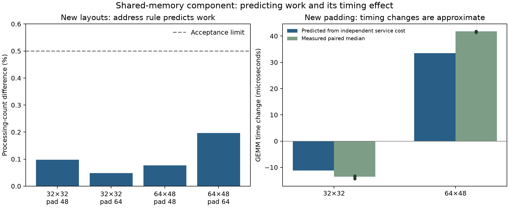

# Predicting a hardware mechanism before measuring the answer

The question is whether we can explain a part of RTX 5090 GEMM runtime from how the GPU handles memory instructions, rather than fit a correction to GEMM timing. The previous layout experiment showed a relationship between shared-memory layout, extra processing, and runtime. This round turns that relationship into executable predictions and checks them on new cases.

We now have a validated model of the main-loop shared-read processing count, an independently measured service model for a small instruction sequence, and a successful but imperfect transfer to GEMM timing changes. The complete absolute GEMM runtime model is still unfinished.

## What the memory addresses tell us

Shared memory is divided into banks. NVIDIA documents a mapping in which consecutive four-byte words occupy consecutive banks, with 32 banks, and reads of one word can be broadcast. We use this as a testable structure and validate it on RTX 5090; we do not assume all timing constants transfer from older GPU generations. [NVIDIA CUDA 12.8.1 programming guide, shared-memory sections](https://docs.nvidia.com/cuda/archive/12.8.1/cuda-c-programming-guide/index.html#shared-memory-5-x).

Our matrices store BF16 values, a 16-bit floating-point format. The compiled operand reads use ordinary 32-bit generic load instructions, displayed as LD.E. They are not specialized matrix-load instructions. In the relevant pattern, every group of four lanes reads four consecutive words from a row; the eight groups read eight different rows. A lane is one thread position within a 32-thread warp. The number of BF16 elements between row starts is the row stride, and each BF16 element occupies two bytes.

For example, a stride of 32 BF16 elements separates rows by 64 bytes, or 16 words. Row starts therefore alternate between bank 0 and bank 16. Four different rows send their distinct words to each used bank. The load needs four processing packages. A stride of 48 elements separates rows by 24 words and reduces that demand to two packages; a stride of 64 elements increases it to eight. Constant aligned offsets rotate bank labels without changing how many distinct words compete in a bank.

The implemented count rule assigns each requested word to its bank, counts distinct words in each bank, and takes the largest count. Duplicate reads of one word are counted once. We then multiply by the scalar operand instructions generated for each matrix tile and repeated reduction stage. This predicts main-loop operand reads; final output handling is excluded.

The compilation check matters. The smaller tile has 16 static LD.E operand-load instructions in its loop body; the larger has 48. Both paths retain those counts in the new layouts. We have validated this lane mapping for these two compiled kernels, not every possible implementation of CUDA’s warp-level matrix interface, WMMA.

## Four new layouts confirmed the count model

Predictions were saved before measurements. The acceptance criterion was at most 0.5% difference between predicted main-loop reads and the profiler's complete shared-read count. The small difference may contain output work and measurement variation; we did not fit it away.

| Tile | Added row padding, BF16 elements | Predicted main-loop packages | Measured total shared-read packages | Difference |
|---|---:|---:|---:|---:|
| 32 by 32 | 48 | 196,608 | 196,800 | 0.098% |
| 32 by 32 | 64 | 393,216 | 393,408 | 0.049% |
| 64 by 48 | 48 | 294,912 | 295,138 | 0.077% |
| 64 by 48 | 64 | 294,912 | 295,491 | 0.196% |

All four passed. Every complete GEMM output was also compared with an independent cuBLAS reference calculation. This validates service-demand prediction in the tested instruction path. These percentages describe counts, not GEMM runtime errors.

## Measure service time without fitting GEMM

We built a small benchmark that repeats four scalar loads per loop, changes row spacing through a runtime argument, and varies the number of active warps. All loaded values are used and every output is checked. Two clock reads surround the repeated loop; several repetition lengths distinguish repeated work from fixed measurement overhead. Ordinary whole-kernel event times are also retained. The sequence includes address calculation, arithmetic, and loop control, so its observed waiting cost is not an individual load's intrinsic latency.

The first probe preserved repeated loads by requesting stronger memory ordering. Its compiled instructions were LD.E.STRONG.SYS, which differ from GEMM's ordinary LD.E. We retained the results as an instruction-form control, rather than adopt those latency measurements as ordinary-load constants.

Removing that modifier exposed a compiler trap: the loads moved outside the loop. Numerical output was still correct, but the timing no longer measured repeated memory operations. Those 54 cases are rejected for service calibration.

The corrected ordinary-load probe alternates between two address sets with identical bank patterns. This keeps loads inside the loop while preserving their values and processing demand. The compiled loop contains the four ordinary LD.E instructions. Three profiler checks confirmed exactly 524,288, 1,048,576, and 2,097,152 shared-read packages, as predicted for the corresponding access patterns. Dynamically executed instruction counts were identical across those three checks.

## Two limits are needed

With enough work ready, four- and eight-package loads exhibit approximately one processing package per clock cycle across a processing unit. But applying that rule alone to conflict-free scalar loads predicted too much speed. The first timing model missed a new twelve-warp, conflict-free case by 24.5%.

That failure motivates a separate scalar-instruction service floor. In the revised model, one scalar warp load requires the larger of its bank-processing demand and a measured two-cycle service floor. The latter is an observed throughput limit for this instruction path; we have not uniquely located it in a private hardware unit.

The model also limits progress by the time needed to complete this particular loop sequence when few warps are ready. Those sequence costs come from the small benchmark, not GEMM. The calculation takes the larger of sequence waiting and aggregate service work, because these limits overlap rather than add as independent elapsed times.

The first model and its failed predictions remain preserved. After freezing the revised model, we tested sixteen new combinations using six or sixteen warps, four row spacings, and two repetition lengths. All outputs passed. Median cycle prediction error was 0.013%, and worst-case error was 4.78%, below the preregistered 5% median and 10% maximum limits. The very small median reflects many saturated cases with nearly integer-cycle service costs; the six-warp cases show the larger residuals. These are small-benchmark cycle errors, not full-GEMM accuracy.

## Did an independently measured cost transfer to GEMM?

We next saved predictions for a previously unmeasured padding of 80 elements. Both kernels used output shape 64 by 96 and reduction length 8192. We held allocated shared memory at 24,576 bytes and the measured resident-block limit at three; neither variant spilled registers into device memory. The few blocks fit on separate processing units, and the per-unit profiler maxima confirm that they were spread across units in these profiles.

We predicted the change from the measured original baseline by multiplying the changed bank-service demand by the independently measured cycle cost and converting cycles using the previously observed clock of about 2.94 GHz. This deliberately tests a simple assumption: the marginal service change is exposed in runtime. It does not include a fitted compiler correction or a new GEMM timing coefficient.

After the initial checks, we repeated original and padded kernels in alternating order over three pairs to check timing drift. The table reports the median of those paired timing differences. Negative changes mean faster execution.

| Tile | Predicted timing change | Measured paired change | Error in the size of the change |
|---|---:|---:|---:|
| 32 by 32 | −11.15 microseconds | −13.51 microseconds | 17.5% |
| 64 by 48 | +33.44 microseconds | +41.77 microseconds | 20.0% |

The two new shared-read counts also match their address-derived predictions within 0.1%, with unchanged global request counts. Both timing directions and the preregistered 30% change-magnitude limit passed. Crucially, the model predicted a speedup for one tile and a slowdown for the other before either new layout was measured. The independently measured hardware cost explains much of each change without fitting to its GEMM answer.

The remaining difference is meaningful. Compiler address instructions and scheduling also change, and overlap is simplified. A small error in total runtime would conceal this uncertainty because most baseline time is supplied by a measurement. We therefore report the 17.5–20.0% error in the predicted change, rather than present this test as a sub-one-percent absolute physical GEMM model.

## Executable result and remaining work

The reusable component is [shared_memory.py](../model_components/shared_memory.py). It predicts bank demand and saturated scalar-load service for the validated path. It rejects unsupported tile mappings, unaligned words, and broadcast timing requests. Its separate probe function includes explicitly labeled sequence costs that must not become GEMM load-latency constants.

The experiment includes eight initial full-GEMM layout checks, two fresh transfer checks, twelve paired full-GEMM controls, four layout profiles, two transfer profiles, and three corrected-probe profiles. There are 54 corrected ordinary-probe cases, six first-model confirmation cases, and sixteen revised-model confirmations. All accepted cases passed numerical checks. Strong-order and compiler-hoisted controls remain labeled separately.

The full model still needs independently validated load-response timing, instruction dependencies, useful overlap, and block scheduling, then absolute predictions on untouched GEMMs. The shared-memory component improves the physical account, but it does not supply those missing mechanisms.

The next focused test is to distinguish the scalar-load service floor from bank service by comparing scalar and wider loads with matched payload and addresses. Separately, the GEMM transfer residual needs a control that holds compiled address work fixed while changing bank placement. Those tests should decide which missing contribution belongs in the runtime model before another GEMM calibration is introduced.

The left panel compares main-loop count predictions with complete measured read counts, including output handling. The right panel compares changes from a measured baseline; dots show the three paired measurements. Neither panel reports absolute full-GEMM prediction accuracy.
