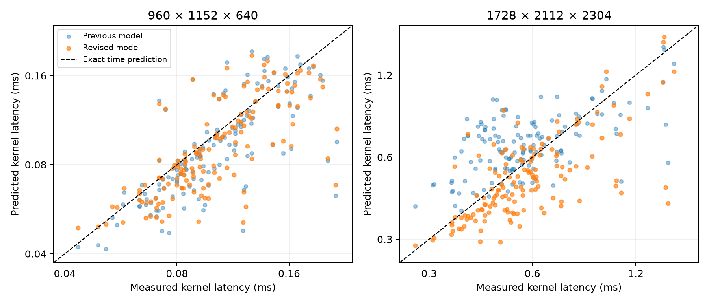

# Physical demand counts improve GEMM tile selection on two new workloads

The revised mixed-integer linear program (MILP) selected the fastest measured tile on both new confirmation workloads. The previous model's choices were 18.9% and 35.9% slower on those same measurements. This supports incorporating the staging and scheduling mechanisms identified in the preceding diagnosis. It does not establish general prediction accuracy or a search-speed advantage over enumeration.

## Question and physical motivation

GEMM multiplies an M-by-K matrix by a K-by-N matrix. Choosing a block's row, column, and reduction dimensions changes how the GPU executes that multiplication. An exact optimizer can still choose a slow kernel if its objective omits the relevant physical costs.

The preceding RTX 5090 diagnosis compared two kernels with identical matrix arithmetic. The faster tile executed about 42% fewer global-load instructions, 41% fewer shared stores, and 57% fewer branches. Fixed-input-stride experiments also found sharp time increases when the smaller tile's block grid crossed resident capacity. Padding nearly eliminated shared-load bank conflicts but did not improve the larger tile under matched allocation. These observations motivated demand and scheduling terms rather than an objective that minimizes conflicts alone. [The physical diagnosis](../diagnostic_004/final_report.md) preserves the interventions and their limits.

## Fixed hardware and kernel

One RTX 5090, device 7, runs all measurements. It reports 170 streaming multiprocessors, 102,400 shared-memory bytes and 65,536 register words per multiprocessor. A block has 128 threads divided into four warps. Inputs use BF16; accumulation and output use FP32. The kernel uses row-major layouts, one input-buffer stage, and 16-by-16-by-16 WMMA matrix instructions. Output fragments are assigned cyclically to the four warps.

The MILP independently chooses the row and column tile dimensions from 16 through 96 in steps of sixteen, and reduction depth from 16 through 64 in steps of sixteen. There are 144 combinations. Compiler resource envelopes summarize registers by fragment burden, reduction depth, and productive-warp count. Neither timing coefficients nor binary decisions form a catalog of complete tile triples.

There is no explicit L2 reuse, cache-capacity, or correction term. Hardware caches remain active. A 512 MiB read sweep precedes each timed launch and is excluded from its timer; it cannot remove caching within a launch. Timings use ten warm-ups followed by nine groups of five launches. Each reported sweep value is the median of those groups, and lower is better.

## What changed in the model

The new model separates maximum per-warp matrix work, total fragment work, first- and second-operand staging, recurring stage control, and approximate shared-load service. It predicts residency from thread, register, and shared-memory limits. A sequential estimate represents block execution. An aggregate estimate includes both rounded block waves and the fraction of resident capacity used, along with whole-device service demand. Predicted time is the larger estimate.

For example, a 32-by-32 output tile has four 16-by-16 fragments. A 64-by-48 tile has twelve. The latter uses three times as much output area per block, so it needs one third as many blocks on an exactly divisible matrix. Both perform equal total matrix work, but their operand staging and repeated block control differ. The new counts expose that difference explicitly.

The shared-load approximation uses operand row-alignment factors derived from tile quotients. Across twelve development profiles, its fitted service-count estimate had 0.068% median and 0.325% maximum relative error. All profiles use a 384-by-512-by-256 workload. This supports a bounded factorized demand approximation for the unpadded kernel; it does not reconstruct the exact per-lane WMMA mapping or establish its service latency.

Rounded waves and fractional-capacity work receive separate fitted weights. This permits different costs for partially filled and full waves, but does not simulate individual block arrivals and completions. Several fitted features remain correlated. Some productive-warp classes have deficient feature rank; even full rank does not prove isolated physical costs. Zero coefficients must not be interpreted as absent mechanisms.

[The complete formulation](formulation.md) defines the counts, equations, calibration, and exact linearization. All integer products have finite bounds and use binary expansion. Quotient and residency indicators represent resource states, not complete tile-performance entries. The objective remains a genuine MILP.

## Development and numerical verification

The new development shapes are 384-by-512-by-256, 1,024-by-1,280-by-768, and 2,048-by-1,536-by-1,536. Sixty new ordinary timings supplement revision 003 calibration and unmodified diagnostic 004 measurements. Repeated conditions are merged by their median, giving 194 distinct conditions from 236 ordinary timing executions. Nonnegative least squares fits sequential and aggregate costs separately, minimizing squared relative error. The median development relative error is 5.10%.

The twelve new service profiles took 45.1 seconds; the sixty new ordinary timings took 33.0 seconds. Their approximately 78-second sum is incremental GPU measurement cost, excluding transport, model development, verification, and previous calibration effort. Reusing prior measurements does not make their original acquisition free.

The direct HiGHS 1.15.1 backend uses microsecond internal time units and zero requested relative optimality gap. The initial one-billionth feasibility tolerance rejected a directly feasible fixed tile at the larger shape, with both presolve settings. The [failed numerical case](numerical_failure.json) is preserved. A one-hundred-millionth tolerance produced agreement for every fixed tile and both unconstrained optima. This verifies the repaired encoding; it does not isolate an upstream solver defect.

Each of the 144 fixed tiles on each confirmation shape was checked against independently calculated time, residency, and waves. Both complete MILP optima agreed with independent enumeration. Solver status alone is not the verification criterion.

The [freeze record](frozen_manifest.json) saves coefficients, solver sources, and both choices before confirmation. The model and solver sources remained unchanged through confirmation. Both shapes and their reduction lengths were previously unmeasured. This distinction prevents fitting to the new results and presenting them as independent success.

## Hardware confirmation

Excess latency is the selected tile's measured time divided by the fastest measured tile's time, minus one. Zero means the selected configuration is fastest in this 144-tile domain, not globally optimal among all GEMM implementations.

| Matrix dimensions M × N × K | Revised choice | Revised time | Previous choice | Previous time | Previous excess latency | Revised excess latency |
|---|---|---:|---|---:|---:|---:|
| 960 × 1,152 × 640 | 32 × 32 × 32 | 0.043405 ms | 32 × 32 × 64 | 0.051603 ms | 18.9% | 0% |
| 1,728 × 2,112 × 2,304 | 64 × 48 × 32 | 0.273626 ms | 32 × 32 × 32 | 0.371923 ms | 35.9% | 0% |

All 288 configurations matched the complete cuBLAS output comparison and had no register spills. Tests use the study's deterministic dyadic inputs; they do not establish numerical accuracy for every possible input. The [full results](results.json) and two `confirmation_*.json` files preserve the measurements.

A separate alternating-order recheck repeated the revised and previous choices three times per shape. The smaller revised choice stayed at 0.043392–0.043411 ms, versus 0.051610–0.052013 ms for the previous choice. The larger revised choice stayed at 0.273613–0.274022 ms, versus 0.371098–0.371917 ms. [These rechecks](paired_recheck.json) corroborate both improvements.

Selection improved more consistently than full-domain timing prediction. Define absolute relative error as the absolute difference between predicted and measured time, divided by measured time. Across all 144 configurations, its median changed from 11.4% to 12.5% on the smaller shape, and from 18.7% to 13.7% on the larger. The smaller case therefore has slightly worse typical time prediction despite selecting the fastest tile.

Each point represents one tile on a newly measured workload; blue shows the previous model and orange the revision. The dashed line represents exact prediction. Both axes use logarithmic scales, so equal spacing represents equal ratios. Many points remain away from the line. Correct selection on two cases does not imply an accurate time model throughout the domain.

## Search efficiency and cost

| Workload | MILP variables | Constraints | MILP solve time | Direct evaluation of all 144 tiles |
|---|---:|---:|---:|---:|
| Smaller confirmation | 859 | 1,908 | 0.911 s | 0.000571 s |
| Larger confirmation | 923 | 2,084 | 3.557 s | 0.000591 s |

MILP times are the recorded local optimizer runs, excluding model construction and independent verification. Enumeration times are medians of five local repetitions using the same fitted objective. Model construction took about 0.0005 seconds in those repetitions. Hardware sweeps remain much more expensive than evaluating the objective, but enumeration is overwhelmingly faster than MILP in this tiny domain. We demonstrate compact independent decisions and short absolute solves, not a MILP speed advantage. Larger search spaces remain a separate question.

## Conclusion and remaining limits

The physical diagnosis led to a constructible linear model that chose the fastest tested tile on two previously unmeasured workloads, including new reduction lengths. The earlier ranking failures were therefore useful evidence for refining the formulation. However, the revision changes both model structure and calibration coverage. Without removing each new term and refitting under identical data, the experiment cannot attribute the improvement uniquely to one addition.

The approximation still lacks exact instruction scheduling, verified per-lane bank behavior, precise partial-wave completion, and complete compiler resource prediction. Typical timing errors remain about 12–14% on these cases, and some tiles have larger errors. A broader fresh-workload test and controlled removal of model terms would distinguish durable physical improvements from fortunate selection on two shapes. Neither activity has been performed in this round. L2 modeling remains excluded.

The bounded answer is positive: measured physical demand and scheduling details can improve a genuine MILP's hardware choices without replacing independent tile decisions with a performance lookup table. The solution is fastest within both tested domains, and the claim remains limited to those domains and this fixed kernel family.
