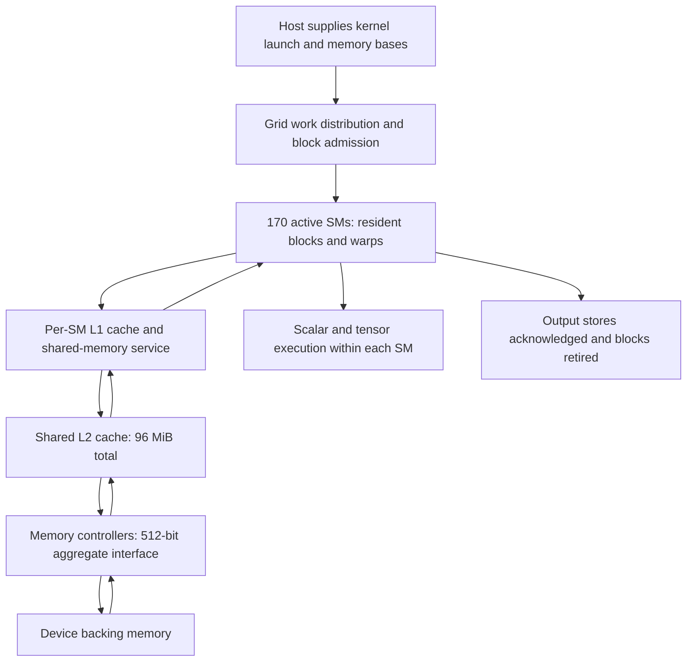
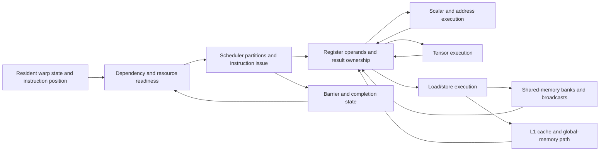
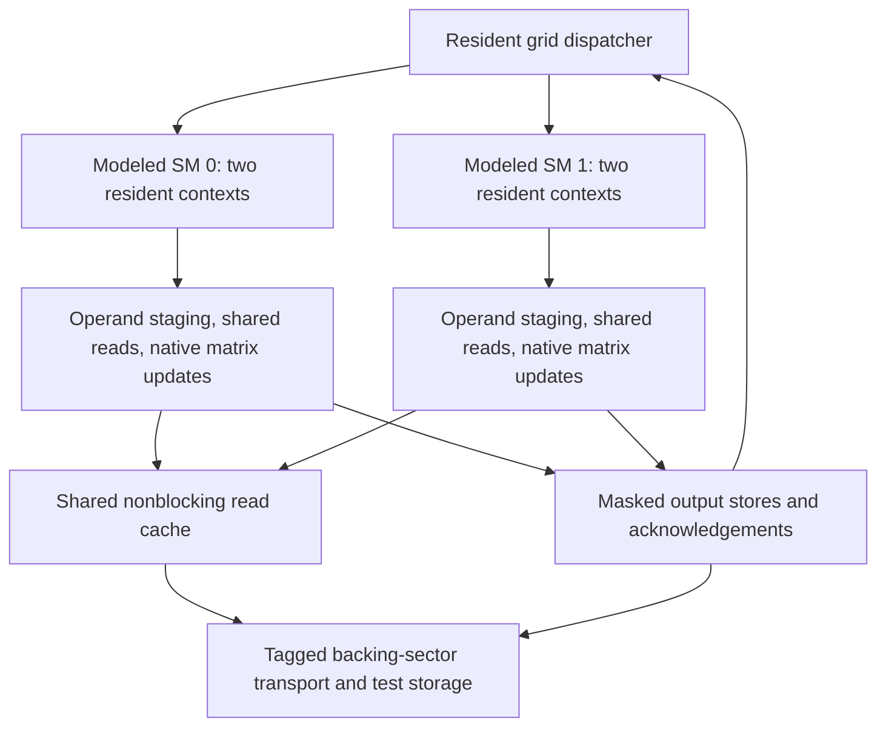

# 00. Whole-GPU microarchitecture overview

[System specification and manual index](../rtl_microarchitecture_spec.md)

## 1. What the GPU must accomplish

A matrix multiplication needs many small groups of threads to fetch operands, compute partial products, and commit results. The GPU runs those groups concurrently. Its performance depends on whether work is ready, whether execution units can accept it, and whether data reaches them fast enough. The overview concentrates on the compute and memory machinery used by GEMM, or general matrix multiplication. Graphics, ray tracing, texture processing and special-function execution are not implemented by the present simulator. This chapter explains the whole machine before the component chapters specify its parts.

A **thread block** is a group of threads with block-local shared memory and synchronization. A **warp** is a group of 32 threads that issues an instruction together, with individual lanes potentially inactive. An **SM**, or streaming multiprocessor, holds resident blocks and executes their warps. **Residency** means a block has been admitted and occupies the resources needed to make progress; it does not mean every resident warp executes every cycle.

The physical organization below combines documented RTX Blackwell structures with the saved device query. It is a functional organization diagram, not a recovered floorplan or exact interconnect topology. The executable reconstruction is shown separately.

## 2. Quantitative organization

| Resource | Recorded organization | Meaning and evidence boundary |
|---|---:|---|
| Active SMs | 170 | Saved device query; active product configuration |
| Warp width | 32 threads | CUDA execution group |
| Architectural scheduler partitions | 4 per SM | RTX Blackwell SM diagram; exact warp assignment is not recovered |
| Architectural Tensor Core blocks | 4 per SM | Documented blocks; internal tensor pipeline count is not inferred |
| Register capacity | 65,536 32-bit words per SM = 256 KiB | Saved query; physical bank/port topology remains provisional |
| Maximum resident warps | 48 per SM | Saved device limit, subject to other resource limits |
| Maximum resident blocks | 24 per SM | Saved device limit, subject to other resource limits |
| Unified L1/shared pool | 128 KiB per SM | Documented pool; allocation preference is not an exact observed carveout |
| Reported shared-memory capacity | 102,400 bytes per SM | Saved query, distinct from the full unified pool |
| Opt-in shared-memory limit | 101,376 bytes per block | Saved query; actual launch allocation must obey its applicable limit |
| Total L2 cache | 96 MiB | Saved query; physical mapping/associativity is not identified by this number |
| Memory interface | 512 bits; sixteen 32-bit controllers | Documented interface organization; DRAM bank mapping remains provisional |
| Reference SM clock | 2.94 GHz | Chosen conversion reference; not a fixed operating clock |

Sources and detailed query scope are retained in the [master parameter table](../parameter_master_table.md) and [architecture-source review](../discovery_rounds/source_sweep_001.md). The documented structures come from the [RTX Blackwell architecture whitepaper](https://images.nvidia.com/aem-dam/Solutions/geforce/blackwell/nvidia-rtx-blackwell-gpu-architecture.pdf). Do not import B200 server-GPU structures into this RTX specification.

## 3. Whole-system organization

The arrows describe requests, data returns and work flow. They do not assert a particular number of internal links or an identified routing policy. Shared memory is block-local storage inside an SM; it is not a level between L1 and L2 on every request. A global load may use L1 or bypass it depending on the instruction policy. A hit still takes service time, and multiple misses can remain outstanding.

## 4. Inside an SM

This is the microarchitecture's functional dependency diagram. The current reconstruction does not implement every box as a general instruction engine. In particular, scalar/address arithmetic is specialized to the GEMM controllers, and translation is a flat-address abstraction. Exact register banking and scheduler routing remain provisional.

An instruction can wait for three different reasons: its input has not arrived; its destination unit cannot accept another operation; or finite storage for the request/result is full. These reasons need separate state in an executable model. A single fixed delay cannot represent every combination.

The numerical path uses BF16, a 16-bit floating-point input representation, and FP32, a 32-bit floating-point accumulator/result representation. Its native matrix operation is HMMA, the instruction family studied in the saved disassembly and numerical tests. These names identify supported operations rather than a general instruction decoder.

## 5. Trace one GEMM tile through the machine

1. The work distributor assigns a matrix tile and reserves a resident block context. Register/shared-memory demand can prevent additional blocks from entering.
2. Warps calculate addresses and submit global loads. Lane requests sharing a 32-byte sector can be combined. Cache hits return retained data; misses reserve fetch and response ownership.
3. Completed operands are stored in shared memory. A barrier prevents matrix consumers from proceeding before the required staging is complete.
4. Shared loads or MOVM/LDSM operations—native instructions that move shared-memory words into matrix operand registers—map words into the matrix instruction's lane/register arrangement. Bank conflicts can increase service work even when the requested byte count is unchanged.
5. Native tensor operations update accumulators. The next dependent operation must wait for the prior result, while other eligible work may progress.
6. Output adapters construct masked stores. The block retires after required stores are acknowledged, then releases its context. Other blocks can reuse the freed resources.

**Coalescing** means combining lane accesses to the same serviced memory sector. **Backpressure** means a receiver with no available capacity prevents acceptance. **Arbitration** means choosing among simultaneously eligible requests. These mechanisms explain why the amount of arithmetic or bytes alone does not determine runtime.

The physical GPU also groups processing resources above the SM level. Their exact active group composition, fabric arbitration, texture and special-function timing are not established by the present component tests. The diagrams therefore expose the known compute hierarchy without assigning invented capacities to those structures.

## 6. Key design features the optimizer must represent

Many resident warps can hide waiting, but registers, shared memory and block slots limit residency. Tensor operations require exact operand layouts and completion ordering. Cache reuse reduces backing traffic, while hit timing, request contention and finite pending ownership still affect progress. Shared-memory banks can broadcast a common word but may serialize distinct words mapping to one bank. Completion and store acknowledgement determine when resources are genuinely reusable.

These are candidate constraints and costs for the MIP, or mixed-integer program. Discrete decisions choose tile shape, layout and schedule; resource limits bound simultaneous work; dependency rules bound start times. Parameters supported only by priors remain provisional until a consequential mismatch requires refinement.

## 7. What is actually connected in the simulator

The latest top implements two modeled SMs, two contexts each, a read-only shared-cache path and disjoint outputs. Its test L2 geometry is 64 KiB with eight consumer-owner slots and four pending-fetch entries. A **pending-fetch entry**, called an MSHR, tracks a miss until its data returns. These settings exercise the mechanism; they are not the physical 96 MiB L2 geometry.

The connected model passed numerical tests checking 24,576 output words. Its cycle timing remains uncalibrated. A separate phase-cost estimator predicted two new workload runtimes within 5%; that result must not be attributed to this Verilog model.

Continue to the [system specification](../rtl_microarchitecture_spec.md) for port contracts and chapter navigation, then follow the component chapters for exact state transitions and linked source.
